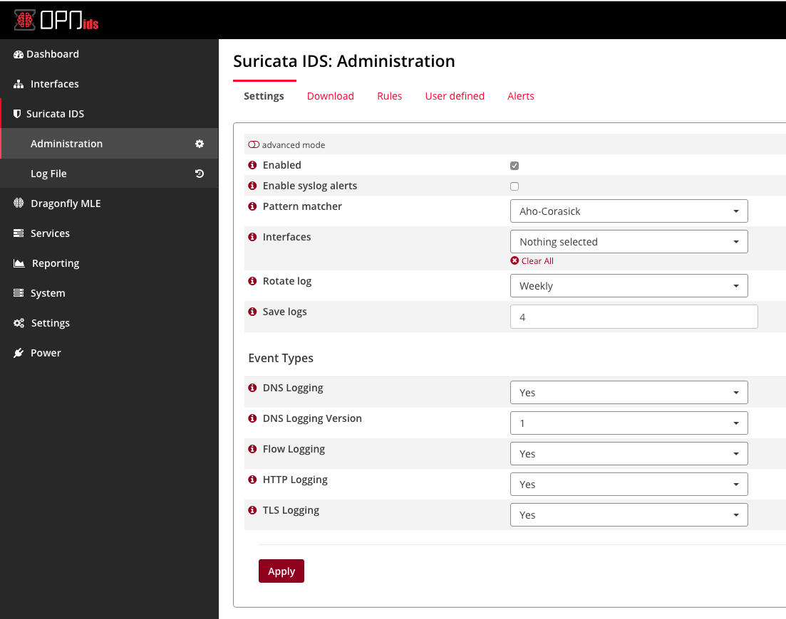
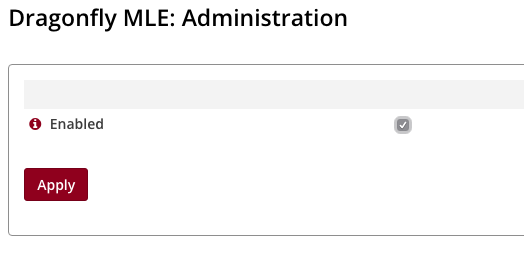
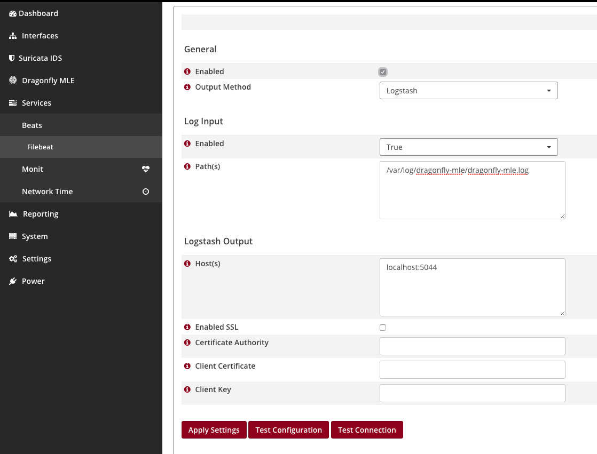
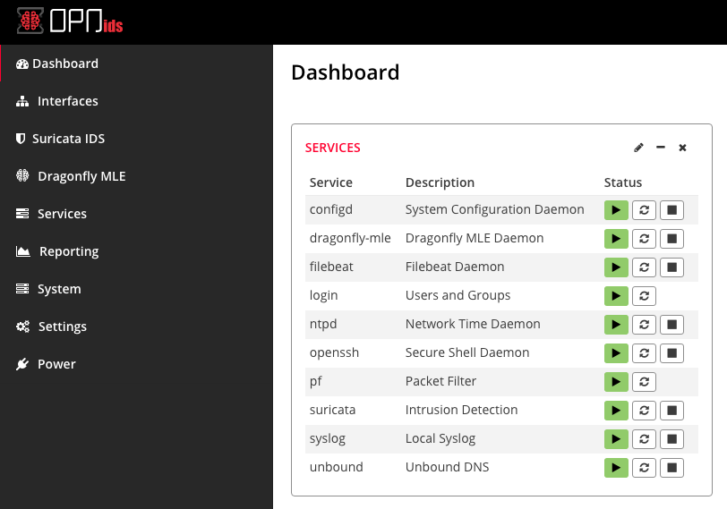
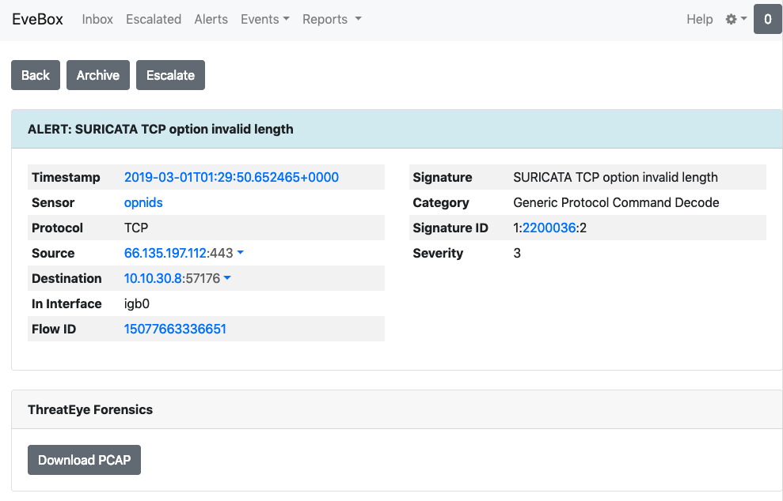
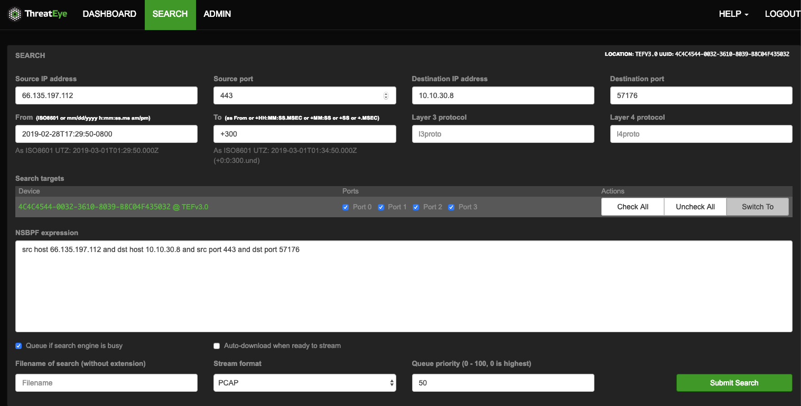

# Setup EveBox with OPNids

### Setup OPNids

Download the latest OPNids distribution from ( [OPNids Download](https://www.opnids.io/download) ).

Once you have OPNids up and running, you can start to configure the proper settings for Suricata, Dragonfly MLE, and Filebeats.

### Setup Suricata

Using the navigation, select `Suricata IDS` > `Administration`.

1. Check the `Enabled` checkbox.
2. Select the interface you would like suricata to be listening on. This should be the interface that is acting as your TAP.
3. Select `Yes` for each event type you are interested in.

Below is a screenshot sample of the settings we have just applied, excluding interface selection. That may vary based on the host you have installed OPNids.



Once you have clicked `Apply`, Suricata will automatically start.

### Setup Dragonfly MLE

Using the navigation, select `Dragonfly MLE` > `Administration`.

1. Check the `Enabled` checkbox.

Once you have clicked `Apply`. Dragonfly MLE will automatically start.



### Setup Filebeats

Using the navigation, select `Services` > `Beats` > `Filebeat`.

1. Check the `Enabled` checkbox.
2. By default, suricata `eve.json` path is located at `/var/log/suricata/eve.json`. We want to switch this to use Dragonfly MLE logs. The default path for Dragonfly MLE logs is `/var/log/dragonfly-mle/dragonfly-mle.log`.
3. Enter the host(s) for your Logstash host.
4. If you are using SSL encryption, enter the path to each file required and check `Enabled SSL` (OPTIONAL).
5. `Apply` settings.

If everything was done right, you can now click `Test Configuration` to test whether you have a valid filebeats configuration. You can also click `Test Connection` to validate that you have a connection to your Logstash host. If both validations are valid then there is nothing else for you to do with the Filebeat settings. Check out the screenshot below.



Once your done, you can navigate to the `Dashboard` in OPNids and click the green play button for Filebeats.

If everything is up and running, you should see all three services running within the `Services` widget.



### Setup Logstash

Your mileage may vary with Logstash, but for simplicity, below is a base configuration for your `logstash.conf`. Where you see `elasticsearch:9200` in the `.conf` should be replace with your Elasticsearch host. You can leave it as its default if your planning to run the Elasticsearch and Logstash using docker-compose.

```yaml
input {
    beats {
        port => 5044
    }
}
filter {
    json {
        source => "message"
        remove_field => ["message"]
    }
}
output {
    elasticsearch {
        hosts => ["elasticsearch:9200"]
        manage_template => false
        index => "logstash-%{+YYYY.MM.dd}"
    }
}
```

### Setup Evebox

Please refer back to [Evebox Documentation](https://github.com/counterflow-ai/evebox/blob/master/README.md)

If you have docker installed on the machine you are using and it's a debian box. do the following.


```sh
# clone repo down
git clone https://github.com/counterflow-ai/evebox.git

# move into the directory
cd ./evebox

# this will build distribution pkgs without you having to install dependencies
./docker.sh release

# install debian package (may need sudo depending on user)
dpkg -i dist/evebox-latest-amd64.deb

# you now should be able to just run the below command. Change localhost to the IP of where your elasticsearch host is
evebox -v -e http://localhost:9200 -i logstash --elasticsearch-keyword keyword
```

### ThreatEye Forensic Integration
If you have a [ThreatEye](https://threateye.io/) Forensics packet capture solution deployed, you can run evebox with support to download PCAP files from it.

When starting EveBox, pass the URL and UUID of the ThreatEye Forensics instance you want to download PCAPs from. For example,

```
$ evebox -v -e http://localhost:9200 --threateye https://threateye.example.com --uuid 4C4C4544-0032-3610-8039-B8C04F435032
```

To download a PCAP, drill down to event details page and click on the `Download PCAP` button. 



This will open the ThreatEye Forensics search page with the search parameters pre-populated with details from the event. Follow the normal search workflow for ThreatEye to submit the search and download PCAP.




Happy Threat Hunting!


