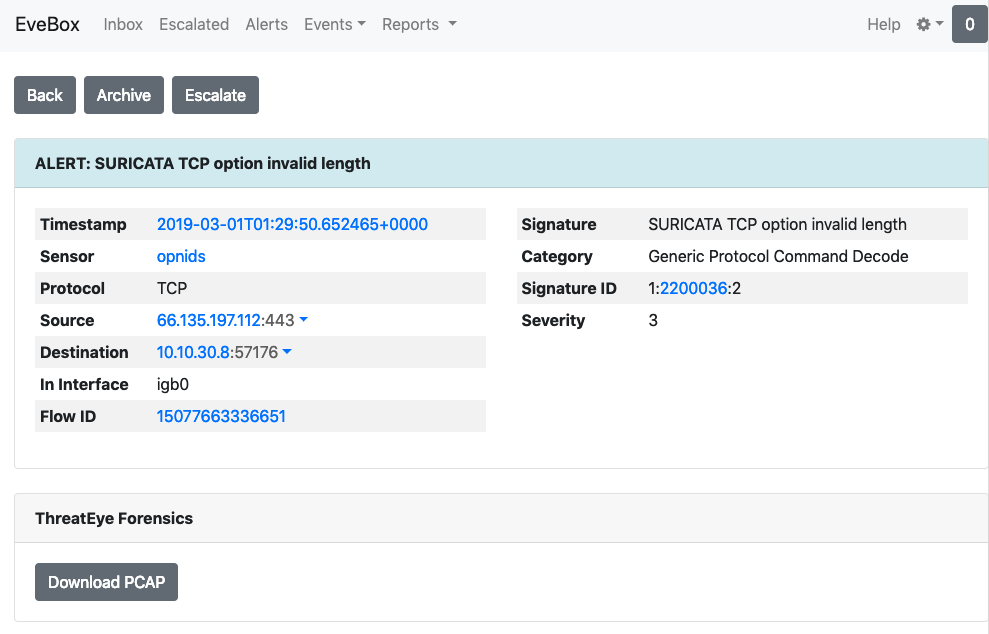
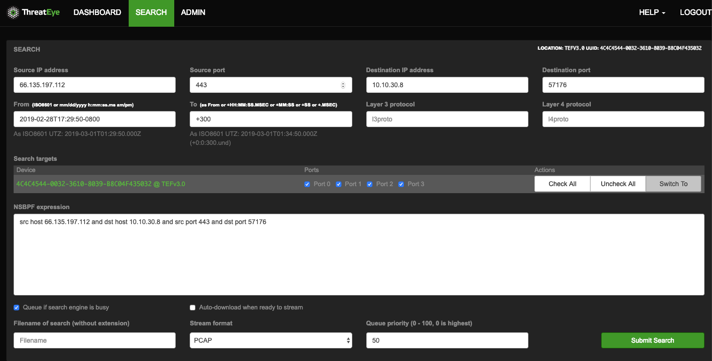

ThreatEye Forensics 
===================

If you have a `ThreatEye`_ Forensics packet capture solution deployed,
you can run evebox with support to download PCAP files from it.

When starting EveBox, pass the URL and UUID of the ThreatEye Forensics
instance you want to download PCAPs from. For example,

::

   $ evebox -v -e http://localhost:9200 --threateye https://threateye.example.com --uuid 4C4C4544-0032-3610-8039-B8C04F435032

To download a PCAP, drill down to event details page and click on the
``Download PCAP`` button.

   Event details

This will open the ThreatEye Forensics search page with the search
parameters pre-populated with details from the event. Follow the normal
search workflow for ThreatEye to submit the search and download PCAP.

   ThreatEye search

.. _ThreatEye: https://threateye.io/
